# 點數系統 (Taipu Point System) 操作手冊

本系統為台譜咖啡提供的點數兌換平台，支援管理員、店家及一般會員三種角色。

# 專案建立

## 1. 啟動前端服務 (Frontend)

### ⚠️ 前置需求
*   **Node.js 版本**：請確保您的 Node.js 版本為 **20.19 或更高版本**（建議使用 LTS 版本，如 v20 或 v22），以支援 Vite 的運行。你可以使用 `node -v` 指令檢查目前版本。

### 環境變數設定 (.env)
你可以透過修改前端專案根目錄下的 `.env.development` 來切換是否使用模擬資料 (MSW)：

*   **情況一: 使用 MSW 模擬資料 (無須後端)**：
    ```env
    VITE_API_BASE_URL=http://localhost:8000
    VITE_USE_MSW=true #改成true(預設)
    ```

*   **情況二: 串接真實後端 (須啟動 Docker 後端，git 網址以及操作流程在下面提供)**：
    ```env
    VITE_API_BASE_URL=http://localhost:8000
    VITE_USE_MSW=false #改成false
    ```

### 啟動步驟：
1.  **安裝依賴**：`npm install`
2.  **執行開發伺服器**：`npm run dev`
---

## 2. 啟動後端服務 (Backend)

後端專案由合作夥伴使用 Django 開發，並提供 Docker 容器化環境供串接使用。
*   **後端 Git 倉庫**：[https://github.com/ga344833/taipu_point.git](https://github.com/ga344833/taipu_point.git)
### 啟動步驟：

1.  **確保 Docker 已啟動**：請確認你的電腦已安裝並開啟 Docker Desktop。
2.  **複製環境變數檔案**：
    ```bash
    cp env.example .env
    ```
3.  **使用 Docker Compose 啟動**：

    ```bash
    docker-compose up -d
    ```
    *啟動後 API 服務預設運行在 `http://localhost:8000`。*
---

## 3. 測試帳號與快速登入
在登入頁面下方提供了「快速測試登入」按鈕，對應帳號資訊如下：
| 角色 | 快速登入按鈕圖案 |
| :--- | :--- |
| **管理員** | ⭐ |
| **店家** | 🏪 |
| **會員** | 👤 |
---

# 角色功能說明

## 1. 會員頁面 (Member)

會員可以在此查看商品、儲值點數並兌換商品。

### 兌換商品

1. 在「兌換商品」分頁查看所有上架商品。

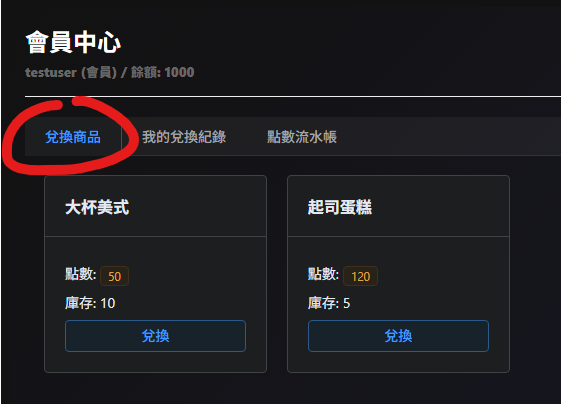

2. 點擊商品卡片上的「兌換」按鈕。

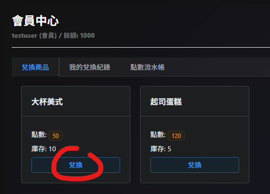

3. 在彈出的視窗中選擇數量（限制：單次最高 5 個且不得超過庫存）。

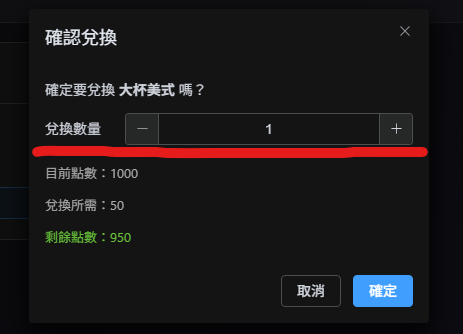

4. 系統會自動計算所需點數與剩餘點數，確認無誤後點擊「確定」。

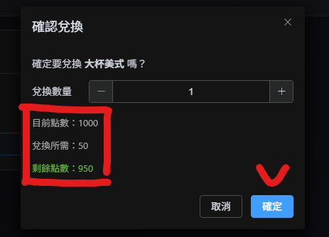

### 儲值點數

- **快速儲值**：點擊右上角的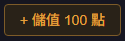按鈕可快速增加點數。

### 查詢紀錄

- **我的兌換紀錄**：查看已兌換的商品、兌換序號及狀態（待核銷 / 已核銷）。

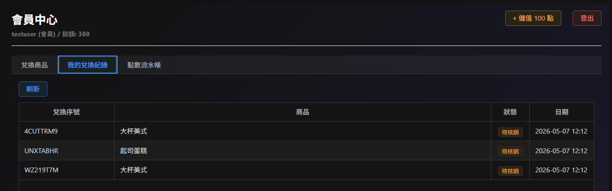

- **點數流水帳**：查看點數的增減紀錄（儲值或兌換扣點）。

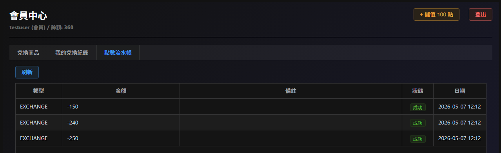

## 2. 店家功能 (Store)

店家負責管理自己店內的商品，並幫會員進行核銷。

### 商品頁面

- **新增商品**：點擊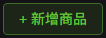，輸入名稱、所需點數、初始庫存及備註。

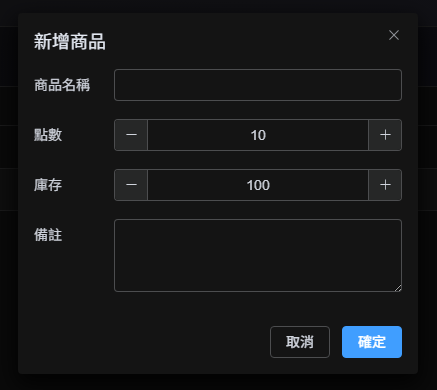

- **刪除商品**：對不再販售的商品點擊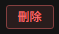（後端採軟刪除，會將商品標記為不啟用；MSW採硬刪除，刪除的商品將無法回復）。

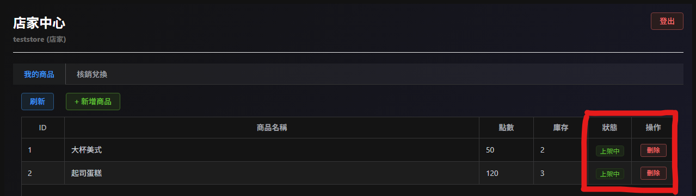

### 核銷兌換

1. 在「核銷兌換」分頁查看所有可核銷的兌換券。

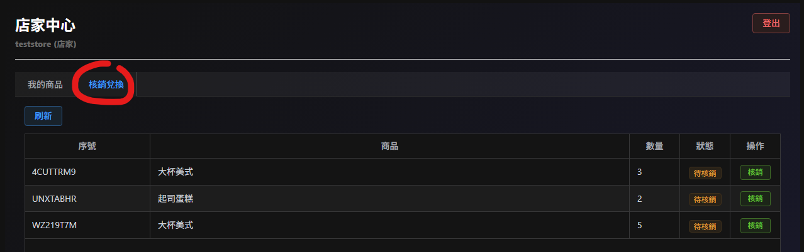

2. 當會員出示兌換序號時，店家找到對應紀錄並點擊「核銷」。

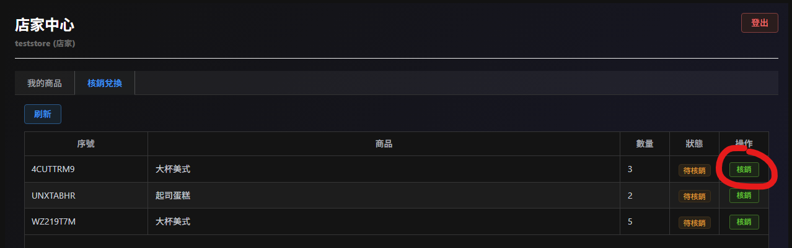

3. 核銷後狀態會變更為「已核銷」。

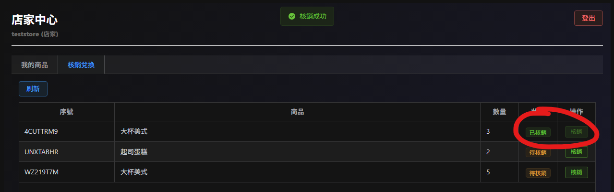

## 3. 管理員頁面 (Admin)

管理員擁有最高權限，可監控全系統的運作。

### 數據監控

- **點數流水帳**：監看全系統所有用戶的點數變動情況。

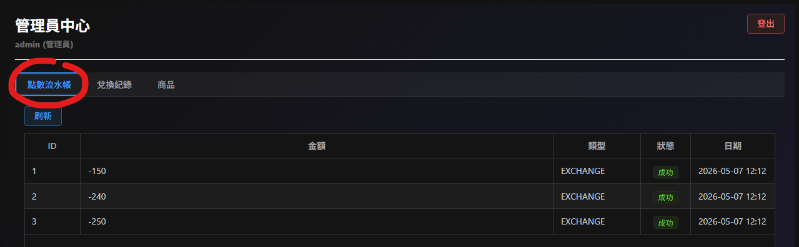

- **兌換紀錄**：查看所有會員的兌換詳情。

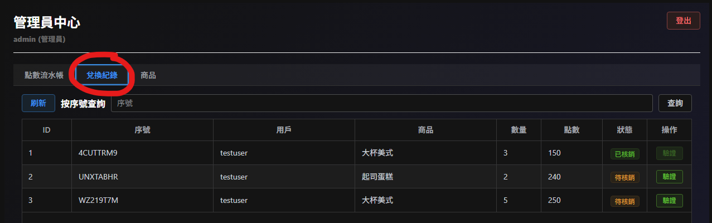

- **按序號查詢**：若有爭議，可直接輸入「兌換序號」精準查詢該筆紀錄（本搜尋只有支援精準查詢）。

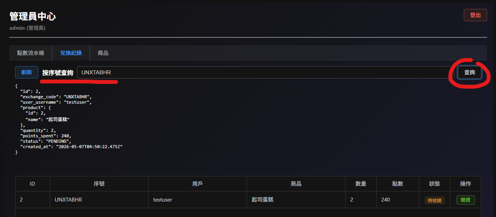

### 系統管理

- **驗證功能**：管理員亦可代為執行兌換驗證（核銷）。

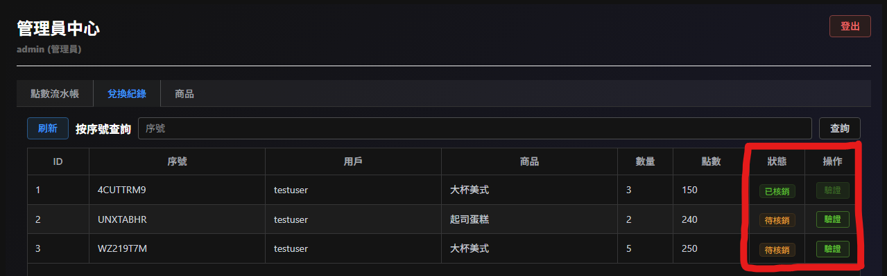

- **商品管理**：可查看所有店家的商品清單，並擁有刪除權限。

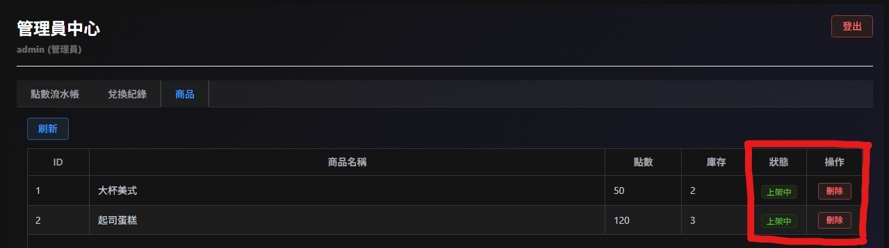